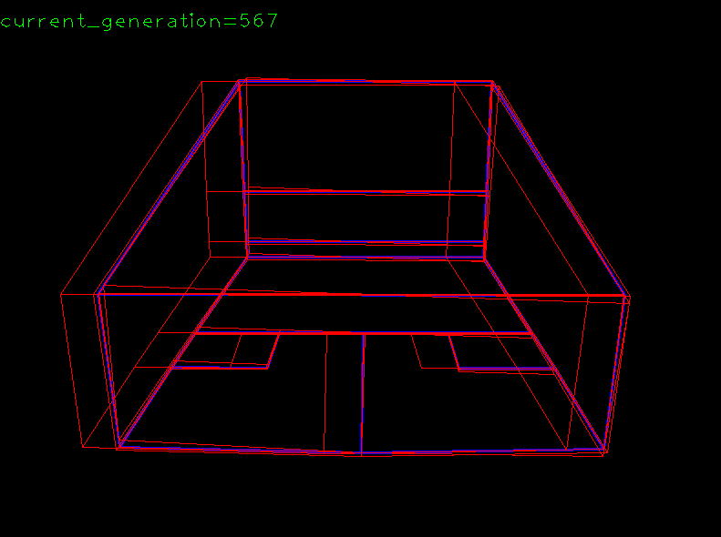
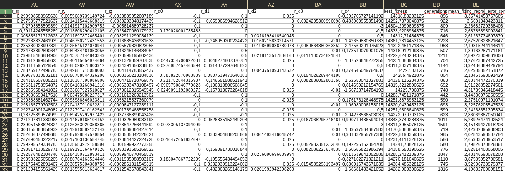

# Evolution Evaluation

# Command line parameters

| Parameter    | Description                          | Default                                 |
| :----------- | :----------------------------------- | :-------------------------------------- |
| `-pf`        | Path to parameters for the algorithm | data/squash/parameters.json             |
| `-gf`        | Path to geometry file for evolution  | data/squash/geometries/squash_court.obj |
| `-erf`       | Output path for evolution results    | evolution_results.csv                   |
| `-nrf`       | Output path for nlopt results        | nlopt_results.csv                       |
| `-evolution` | Run evolution experiments            | (flag)                                  |
| `-nlopt`     | Run NLOPT experiments                | (flag)                                  |
| `-headless`  | Run experiments headless             | (flag)                                  |

e.g.: `python evaluation.py -erf evo_results.csv -nrf nlopt_results.csv -evolution -evolution -nlopt`

Results can be found in `data/`

> **Please Note**: A PARALELLIZED VERSION FOR PERFORMANCE BOOST IS CURRENTLY UNDER DEVELOPMENT

# Evolution Evaluation

-   The `target` vector represents always the mean camera.
-   The `start` vector represents the "wiggled" mean camera:

The number of wiggled parameters is set to 7, which is 46% of all 15 parameters. Every parameter has a chance to get selected for variation. The amount of wiggling is specified as follows:

| Parameter |          Description          |  Near  | Medium | Far  |
| :-------- | :---------------------------: | :----: | :----: | :--: |
| fu        |            focal u            |  ±10   |  ±50   | ±100 |
| fv        |            focal v            |  ±10   |  ±50   | ±100 |
| cx        | principal point offset x [px] |  ±10   |  ±50   | ±100 |
| cy        | principal point offset y [px] |  ±10   |  ±50   | ±100 |
| tx        |     translation in x [m]      |  ±0.1  |  ±0.5  | ±1.0 |
| ty        |     translation in y [m]      |  ±0.1  |  ±0.5  | ±2.0 |
| tz        |     translation in z [m]      |  ±0.1  |  ±0.5  | ±1.0 |
| rx        |      rotation in x [rad]      | ±0.01  |  ±0.1  | ±0.2 |
| ry        |      rotation in y [rad]      | ±0.01  |  ±0.1  | ±0.2 |
| rz        |      rotation in z [rad]      | ±0.01  |  ±0.1  | ±0.2 |
| d0        |     distortion parameter      |  ±0.1  | ±0.25  | ±0.5 |
| d1        |     distortion parameter      |  ±0.1  | ±0.25  | ±0.5 |
| d2        |     distortion parameter      | ±0.025 |  ±0.1  | ±0.2 |
| d3        |     distortion parameter      | ±0.01  | ±0.05  | ±0.1 |
| d4        |     distortion parameter      |  ±0.5  |  ±1.5  | ±3.0 |

### Start camera specification

Given a randomly chosen wiggle vector for a specified distance type, the start is defined by:

    ['s_fu', 's_fv', 's_cx', 's_cy', 's_tx', 's_ty', 's_tz', 's_rx', 's_ry', 's_rz', 's_d0', 's_d1', 's_d2', 's_d3', 's_d4']

### Target camera specification

The (in a real world application unknown) target values are:

    ['t_fu', 't_fv', 't_cx', 't_cy', 't_tx', 't_ty', 't_tz', 't_rx', 't_ry', 't_rz' 't_d0', 't_d1', 't_d2', 't_d3', 't_d4']

> Pleas Note that this is <ins>always</ins> the mean squash camera in **our synthetic case**!

### Evolution Algorithm related variables

| Variable       | Description                                  | Variants                         |
| :------------- | :------------------------------------------- | :------------------------------- |
| population_fn  | Strategy for creating the initial population | BoundedUniformPopulation         |
|                |                                              | ValueUniformPopulation           |
| fitness_fn     |                                              | DistanceMap                      |
|                |                                              | DistanceMapWithPunishment        |
| selection_fn   |                                              | RouletteWheel                    |
|                |                                              | Tournament                       |
|                |                                              | Random                           |
| crossover_fn   |                                              | SinglePoint                      |
|                |                                              | TwoPoint                         |
| mutation_fn    |                                              | BoundedUniformMutation           |
|                |                                              | BoundedDistributionBasedMutation |
| termination_fn |                                              | MaxIteration                     |
|                |                                              | NoImprovement                    |
|                |                                              | FitnessReached                   |
|                |                                              | And                              |
|                |                                              | Or                               |

### Noise related variables

| Variable   | Description | Variants      |
| :--------- | :---------- | :------------ |
| noise_type |             | no_noise      |
|            |             | salt          |
|            |             | hlines        |
|            |             | straight_grid |
|            |             | angled_grid   |

### Output Format

The result file is a comma separated value file with the following specification:

**Strategy bundle columns**

| Column          | Description                                 | Note               |
| --------------- | ------------------------------------------- | ------------------ |
| nlopt_optimizer | nlopt optimizer used                        | **NLOPT ONLY**     |
| population_fn   | Population strategy                         | **EVOLUTION ONLY** |
| fitness_fn      | Fitness stategy                             |                    |
| selection_fn    | Selection strategy                          | **EVOLUTION ONLY** |
| crossover_fn    | Crossover strategy                          | **EVOLUTION ONLY** |
| mutation_fn     | Mutation strategy                           | **EVOLUTION ONLY** |
| termination_fn  | Termination strategy                        | **EVOLUTION ONLY** |
| distance_type   | Distance selected for the wiggle operator   |                    |
| noise_type      | Noise type                                  |                    |
| noise_value     | If applicable: Parameter for the noise type |                    |

**Camera columns**

| Column | Description                                            |
| ------ | :----------------------------------------------------- |
| s_fu   | **Start camera** fu parameter (Focal u)                |
| s_fv   | **Start camera** fv parameter (Focal v)                |
| s_cx   | **Start camera** cx parameter (Central point offset x) |
| s_cy   | **Start camera** cy parameter (Central point offset y) |
| s_tx   | **Start camera** tu parameter (Translation X)          |
| s_ty   | **Start camera** ty parameter (Translation Y)          |
| s_tz   | **Start camera** tz parameter (Translation Z)          |
| s_rx   | **Start camera** ru parameter (Rotation X)             |
| s_ry   | **Start camera** ry parameter (Rotation Y)             |
| s_rz   | **Start camera** rz parameter (Rotation Z)             |
| s_d0   | **Start camera** d0 parameter (Distortion k1)          |
| s_d1   | **Start camera** d1 parameter (Distortion k2)          |
| s_d2   | **Start camera** d2 parameter (Distortion p1)          |
| s_d3   | **Start camera** d3 parameter (Distortion p2)          |
| s_d4   | **Start camera** d4 parameter (Distortion k3)          |

| Column | Description                                             |
| ------ | ------------------------------------------------------- |
| t_fu   | **Target camera** fu parameter (Focal u)                |
| t_fv   | **Target camera** fv parameter (Focal v)                |
| t_cx   | **Target camera** cx parameter (Central point offset x) |
| t_cy   | **Target camera** cy parameter (Central point offset y) |
| t_tx   | **Target camera** tu parameter (Translation X)          |
| t_ty   | **Target camera** ty parameter (Translation Y)          |
| t_tz   | **Target camera** tz parameter (Translation Z)          |
| t_rx   | **Target camera** ru parameter (Rotation X)             |
| t_ry   | **Target camera** ry parameter (Rotation Y)             |
| t_rz   | **Target camera** rz parameter (Rotation Z)             |
| t_d0   | **Target camera** d0 parameter (Distortion k1)          |
| t_d1   | **Target camera** d1 parameter (Distortion k2)          |
| t_d2   | **Target camera** d2 parameter (Distortion p1)          |
| t_d3   | **Target camera** d3 parameter (Distortion p2)          |
| t_d4   | **Target camera** d4 parameter (Distortion k3)          |

| Column | Description                                            |
| ------ | ------------------------------------------------------ |
| r_fu   | **Resultcamera** fu parameter (Focal u)                |
| r_fv   | **Resultcamera** fv parameter (Focal v)                |
| r_cx   | **Resultcamera** cx parameter (Central point offset x) |
| r_cy   | **Resultcamera** cy parameter (Central point offset y) |
| r_tx   | **Resultcamera** tu parameter (Translation X)          |
| r_ty   | **Resultcamera** ty parameter (Translation Y)          |
| r_tz   | **Resultcamera** tz parameter (Translation Z)          |
| r_rx   | **Resultcamera** ru parameter (Rotation X)             |
| r_ry   | **Resultcamera** ry parameter (Rotation Y)             |
| r_rz   | **Resultcamera** rz parameter (Rotation Z)             |
| r_d0   | **Resultcamera** d0 parameter (Distortion k1)          |
| r_d1   | **Resultcamera** d1 parameter (Distortion k2)          |
| r_d2   | **Resultcamera** d2 parameter (Distortion p1)          |
| r_d3   | **Resultcamera** d3 parameter (Distortion p2)          |
| r_d4   | **Resultcamera** d4 parameter (Distortion k3)          |

**Result columns**

| Column                        | Description                                                                    |
| ----------------------------- | ------------------------------------------------------------------------------ |
| best_fitness                  | Best achieved fitness                                                          |
| generations                   | Number of generations until convergence                                        |
| mean_fitting_reproj_error_col | Mean reprojection error for fitting geometry (horizontal in image space)       |
| mean_fitting_reproj_error_row | Mean reprojection error for fitting geometry (vertical in image space)         |
| mean_dense_reproj_error_col   | Mean reprojection error for dense sampled geometry (horizontal in image space) |
| mean_dense_reproj_error_row   | Mean reprojection error for dense sampled geoemtry (vertical in image space)   |
| mean_y0_reproj_error_col      | Mean reprojection error for court floor geometry (horizontal in image space)   |
| mean_y0_reproj_error_row      | Mean reproejction error for court floor geometry (vertical in image space)     |

### Citation

Please cite in your publications if it helps your research:

    TBA

### License

This program is free software: you can redistribute it and/or modify
it under the terms of the GNU General Public License as published by
the Free Software Foundation, either version 3 of the License, or
(at your option) any later version.

This program is distributed in the hope that it will be useful,
but WITHOUT ANY WARRANTY; without even the implied warranty of
MERCHANTABILITY or FITNESS FOR A PARTICULAR PURPOSE. See the
GNU General Public License for more details.

You should have received a copy of the GNU General Public License
along with this program. If not, see <https://www.gnu.org/licenses/>.
